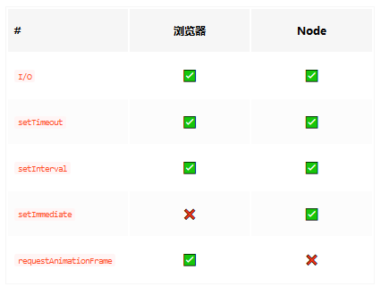
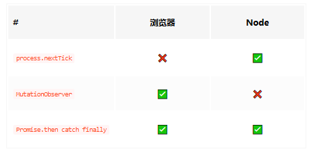

### 宏任务与微任务

执行完某个宏任务，如果有相应的微任务则执行，然后执行下一个宏任务。

**宏任务**



**微任务**



```js
function handler () {
  console.log('click') //直接输出
  Promise.resolve().then(()=> console.log('promise')) //注册微任务
  setTimeout(()=> console.log('timeout')) //注册宏任务
  requestAnimationFrame(()=> console.log('animationFrame')) 
  document.body.setAttribute('data-random', Math.random()) //触发微任务
}
document.body.addEventListener('click', handler)
new MutationObserver(()=> {
  console.log('observer')
}).observe(document.body, {
  attributes: true
}) //注册微任务
```
谷歌 ：click>promise>observer>animationFrame>timeout

火狐 ：animationFrame与timeout顺序不确定

>requestAnimationFrame不确定是属于宏任务还是微任务
