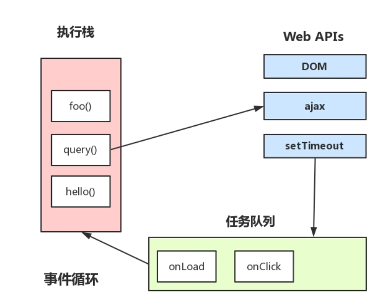
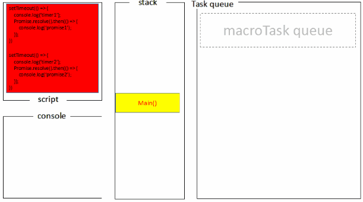

### 主线程和调用栈

所有的任务都会被放到调用栈等待主线程执行。

### 调用栈

JS调用栈采用的是先进后出的规则，当函数执行的时候，会被添加到栈的顶部，当执行完后，就会从栈顶移出，直到栈内被清空。

!>函数内调用函数，就很适合使用栈这种数据结构。

### 同步任务和异步任务

`Javascript`单线程任务被分为**同步任务**和**异步任务**，同步任务会按照顺序依次放入调用栈中等待主线程执行，异步任务会在异步任务有了结果后，将注册的回调函数放入任务队列中等待主线程空闲的时候（同步任务执行完），读取到栈内等待主线程的执行。


### 任务队列

任务队列分为宏任务队列与微任务队列

### 事件循环

执行栈在执行完同步任务后，查看执行栈是否为空，如果执行栈为空，就会去检查微任务(microTask)队列是否为空，如果为空的话，就执行Task（宏任务），否则就一次性执行完所有微任务。

每次单个宏任务执行完毕后，检查微任务(microTask)队列是否为空，如果不为空的话，会按照先入先出的规则全部执行完微任务(microTask)后，然后再执行宏任务，如此循环。

```js
console.log('script start');

setTimeout(function() {
  console.log('setTimeout');
}, 0);

Promise.resolve().then(function() {
  console.log('promise1');
}).then(function() {
  console.log('promise2');
});
console.log('script end');
```

* 执行同步代码，将宏任务（Tasks）和微任务(Microtasks)划分到各自队列中。

* 同步代码后，检测到微任务(Microtasks)队列中不为空，执行Promise1，执行完成Promise1后，调用Promise2.then，放入微任务(Microtasks)队列中，再执行Promise2.then。

* 当微任务(Microtasks)队列中为空时，执行宏任务（Tasks），执行setTimeout callback，打印日志。



```js
console.log('script start')

async function async1() {
  await async2()
  console.log('async1 end')
}
async function async2() {
  console.log('async2 end') 
}
async1()

setTimeout(function() {
  console.log('setTimeout')
}, 0)

new Promise(resolve => {
  console.log('Promise')
  resolve()
})
  .then(function() {
    console.log('promise1')
  })
  .then(function() {
    console.log('promise2')
  })

console.log('script end')
```
chrome73以下版本，火狐：

* 首先，打印script start，调用async1()时，返回一个Promise，所以打印出来async2 end。
!> async2()内都是同步代码，可以理解为new Promise中的同步代码，console.log('async1 end')为then之后的逻辑

* 每个 await，会新产生一个promise,但这个过程本身是异步的，所以该await后面不会立即调用。

* 继续执行同步代码，打印Promise和script end，将then函数放入微任务队列中等待执行。

* 同步执行完成之后，检查微任务队列是否为null，然后按照先入先出规则，依次执行。

* 然后先执行打印promise1,此时then的回调函数返回undefinde，此时又有then的链式调用，又放入微任务队列中，再次打印promise2。

* 再回到await的位置执行返回的 Promise 的 resolve 函数，这又会把 resolve 丢到微任务队列中，打印async1 end。

!>chrome73 async1 end 在 promise1 之前

* 当微任务队列为空时，执行宏任务,打印setTimeout。


