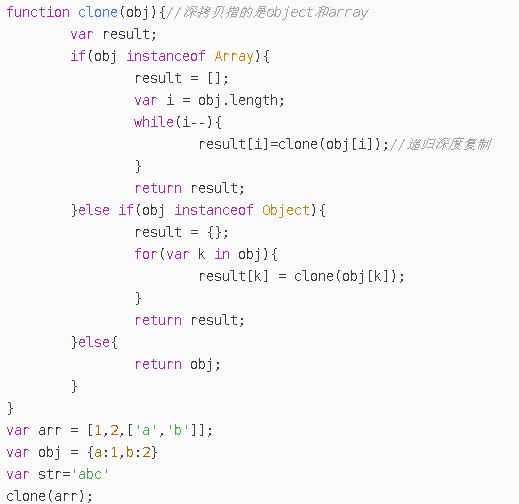

### 浅拷贝
```js
function cloneShallow(source) {
    var target = {};
    for (var key in source) {
        if (Object.prototype.hasOwnProperty.call(source, key)) {
            target[key] = source[key];
        }
    }
    return target;
}
```

### 深拷贝
[https://github.com/yygmind/blog/issues/29](https://github.com/yygmind/blog/issues/29)



