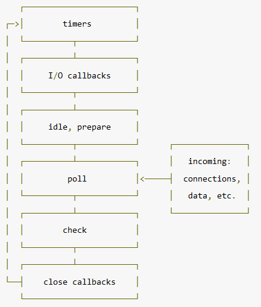

>当Node.js启动时会初始化event loop, 每一个event loop都会包含按如下顺序六个循环阶段



* **timers 阶段**: 这个阶段执行setTimeout(callback) and setInterval(callback)预定的callback;
* **I/O callbacks 阶段**: 执行除了 close事件的callbacks、被timers(定时器，setTimeout、setInterval等)设定的callbacks、setImmediate()设定的callbacks之外的callbacks;
* **idle, prepare 阶段**: 仅node内部使用;
* **poll 阶段**: 获取新的I/O事件, 适当的条件下node将阻塞在这里;
* **check 阶段**: 执行setImmediate() 设定的callbacks;
* **close callbacks 阶段**: 比如socket.on(‘close’, callback)的callback会在这个阶段执行.


每一个阶段都有一个装有callbacks的FIFO queue(队列)，当event loop运行到一个指定阶段时， node将执行该阶段的FIFO queue(队列)，当队列callback执行完或者执行callbacks数量超过该阶段的上限时， event loop会转入下一下阶段。

!>上面六个阶段都不包括 process.nextTick()

**poll阶段**

poll阶段是衔接整个event loop各个阶段比较重要的阶段。

在node.js里，任何异步方法（除timer,close,setImmediate之外）完成时，都会将其callback加到poll queue里,并立即执行。

poll 阶段有两个主要的功能：

* 处理poll队列（poll quenue）的事件(callback);
* 执行timers的callback,当到达timers指定的时间时;

如果event loop进入了 poll阶段，且代码未设定timer，将会发生下面情况：

* 如果poll queue不为空，event loop将同步的执行queue里的callback,直至queue为空，或执行的callback到达系统上限;

* 如果poll queue为空，将会发生下面情况：

  * 如果代码已经被setImmediate()设定了callback, event loop将结束poll阶段进入check阶段，并执行check阶段的queue (check阶段的queue是 setImmediate设定的)

  * 如果代码没有设定setImmediate(callback)，event loop将阻塞在该阶段等待callbacks加入poll queue;

如果event loop进入了 poll阶段，且代码设定了timer：

* 如果poll queue进入空状态时（即poll 阶段为空闲状态），event loop将检查timers,如果有1个或多个timers时间时间已经到达，event loop将按循环顺序进入 timers 阶段，并执行timer queue.

**例子1**

```js
var fs = require('fs');

function someAsyncOperation (callback) {
  // 花费2毫秒
  fs.readFile(__dirname + '/' + __filename, callback);
}

var timeoutScheduled = Date.now();
var fileReadTime = 0;

setTimeout(function () {
  var delay = Date.now() - timeoutScheduled;
  console.log('setTimeout: ' + (delay) + "ms have passed since I was scheduled");
  console.log('fileReaderTime',fileReadtime - timeoutScheduled);
}, 10);

someAsyncOperation(function () {
  fileReadtime = Date.now();
  while(Date.now() - fileReadtime < 20) {

  }
});
```

结果: 先执行someAsyncOperation的callback,再执行setTimeout callback

>-> node eventloop.js
setTimeout: 22ms have passed since I was scheduled
fileReaderTime 2

解释：
当时程序启动时，event loop初始化：

1、timer阶段（无callback到达，setTimeout需要10毫秒）

2、i/o callback阶段，无异步i/o完成

3、忽略

4、poll阶段，阻塞在这里，当运行2ms时，fs.readFile完成，将其callback加入 poll队列，并执行callback， 其中callback要消耗20毫秒,等callback之行完，poll处于空闲状态，由于之前设定了timer，因此检查timers,发现timer设定时间是20ms，当前时间运行超过了该值，因此，立即循环回到timer阶段执行其callback,因此，虽然setTimeout的20毫秒，但实际是22毫秒后执行。
