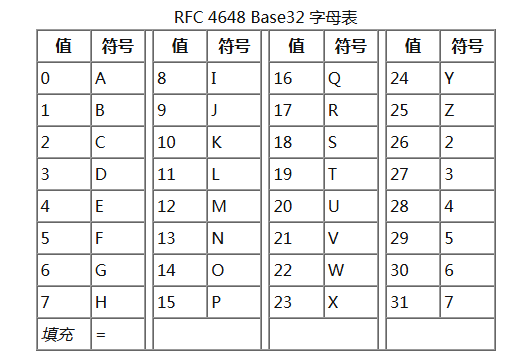
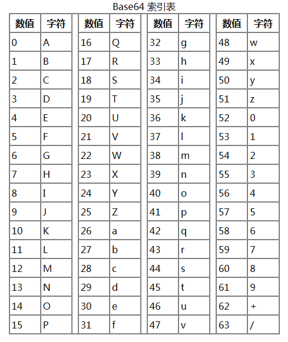

### ASCII，Unicode 和 UTF-8

#### ASCII 码
计算机内部，所有信息最终都是一个二进制值。每一个二进制位（bit）有0和1两种状态，因此八个二进制位就可以组合出256种状态，这被称为一个字节（byte）。也就是说，一个字节一共可以用来表示256种不同的状态，每一个状态对应一个符号，就是256个符号，从00000000到11111111。

上个世纪60年代，美国制定了一套字符编码，对英语字符与二进制位之间的关系，做了统一规定。这被称为 ASCII 码，一直沿用至今。

ASCII 码一共规定了128个字符的编码，比如空格SPACE是32（二进制00100000），大写的字母A是65（二进制01000001）。这128个符号（包括32个不能打印出来的控制符号），只占用了一个字节的后面7位，最前面的一位统一规定为0。

英语用128个符号编码就够了，但是用来表示其他语言，128个符号是不够的。比如，在法语中，字母上方有注音符号，它就无法用 ASCII 码表示。于是，一些欧洲国家就决定，利用字节中闲置的最高位编入新的符号。比如，法语中的é的编码为130（二进制10000010）。这样一来，这些欧洲国家使用的编码体系，可以表示最多256个符号。

但是，这里又出现了新的问题。不同的国家有不同的字母，因此，哪怕它们都使用256个符号的编码方式，代表的字母却不一样。比如，130在法语编码中代表了é，在希伯来语编码中却代表了字母Gimel (ג)，在俄语编码中又会代表另一个符号。但是不管怎样，所有这些编码方式中，0--127表示的符号是一样的，不一样的只是128--255的这一段。

#### Unicode
正如上一节所说，世界上存在着多种编码方式，同一个二进制数字可以被解释成不同的符号。因此，要想打开一个文本文件，就必须知道它的编码方式，否则用错误的编码方式解读，就会出现乱码。为什么电子邮件常常出现乱码？就是因为发信人和收信人使用的编码方式不一样。

可以想象，如果有一种编码，将世界上所有的符号都纳入其中。每一个符号都给予一个独一无二的编码，那么乱码问题就会消失。这就是 Unicode，就像它的名字都表示的，这是一种所有符号的编码。

Unicode 当然是一个很大的集合，现在的规模可以容纳100多万个符号。每个符号的编码都不一样，比如，U+0639表示阿拉伯字母Ain，U+0041表示英语的大写字母A，U+4E25表示汉字严

>体的符号对应表：[unicode.org](http://www.unicode.org/)，或者[专门的汉字对应表](http://www.chi2ko.com/tool/CJK.htm)。

Unicode 只是一个符号集，它只规定了符号的二进制代码，却没有规定这个二进制代码应该如何存储。

比如，汉字严的 Unicode 是十六进制数4E25，转换成二进制数足足有15位（100111000100101），也就是说，这个符号的表示至少需要2个字节。表示其他更大的符号，可能需要3个字节或者4个字节，甚至更多。

这里就有两个严重的问题，第一个问题是，如何才能区别 Unicode 和 ASCII ？计算机怎么知道三个字节表示一个符号，而不是分别表示三个符号呢？第二个问题是，我们已经知道，英文字母只用一个字节表示就够了，如果 Unicode 统一规定，每个符号用三个或四个字节表示，那么每个英文字母前都必然有二到三个字节是0，这对于存储来说是极大的浪费，文本文件的大小会因此大出二三倍，这是无法接受的。

#### UTF-8
互联网的普及，强烈要求出现一种统一的编码方式。UTF-8 就是在互联网上使用最广的一种 Unicode 的实现方式。其他实现方式还包括 UTF-16（字符用两个字节或四个字节表示）和 UTF-32（字符用四个字节表示），不过在互联网上基本不用。重复一遍，这里的关系是，UTF-8 是 Unicode 的实现方式之一。

UTF-8 的编码规则很简单，只有二条：

1）对于单字节的符号，字节的第一位设为0，后面7位为这个符号的 Unicode 码。因此对于英语字母，UTF-8 编码和 ASCII 码是相同的。

2）对于n字节的符号（n > 1），第一个字节的前n位都设为1，第n + 1位设为0，后面字节的前两位一律设为10。剩下的没有提及的二进制位，全部为这个符号的 Unicode 码。

下表总结了编码规则，字母x表示可用编码的位。

| Unicode符号范围 | UTF-8编码方式 |
| - | - |
|(十六进制)|（二进制）|
|0000 0000-0000 007F | 0xxxxxxx |
|0000 0080-0000 07FF | 110xxxxx 10xxxxxx |
|0000 0800-0000 FFFF | 1110xxxx 10xxxxxx 10xxxxxx |
|0001 0000-0010 FFFF | 11110xxx 10xxxxxx 10xxxxxx 10xxxxxx |

跟据上表，解读 UTF-8 编码非常简单。如果一个字节的第一位是0，则这个字节单独就是一个字符；如果第一位是1，则连续有多少个1，就表示当前字符占用多少个字节。

下面，还是以汉字严为例，演示如何实现 UTF-8 编码。

严的 Unicode 是4E25（100111000100101），根据上表，可以发现4E25处在第三行的范围内（0000 0800 - 0000 FFFF），因此严的 UTF-8 编码需要三个字节，即格式是1110xxxx 10xxxxxx 10xxxxxx。然后，从严的最后一个二进制位开始，依次从后向前填入格式中的x，多出的位补0。这样就得到了，严的 UTF-8 编码是11100100 10111000 10100101，转换成十六进制就是E4B8A5。

### Base编码系列
#### Base16(十六进制编码)

Base16编码使用16个ASCII可打印字符（数字0-9和字母A-F）对任意字节数据进行编码。

Base16先获取输入字符串每个字节的二进制值，然后将其串联进来，再按照4比特一组进行切分。

>一个字节的二进制最大数为11111111，最小为00000000。4位一组最大为1111，对应16进制就是F，最小是0。

两个16进制编码就可以表示原数据中的一个字节数据。

Base16编码后的数据量是原数据的两倍。(一个字节的数据需要两个十六进制字符去编码，一个十六进制字符最小占一个字节(ASCII编码))

#### Base32
Base32编码是使用32个可打印字符（字母A-Z和数字2-7）对任意字节数据进行编码的方案，编码后的字符串不用区分大小写并排除了容易混淆的字符（没有0，1，8，避免与I，B，O混淆），可以方便地由人类使用并由计算机处理。

Base32先获取输入字符串每个字节的二进制值，然后将其串联进来，再按照5比特一组进行切分。Base32按5比特切分的二进制数据必须是40比特的倍数。

比如“严”字的utf8编码，对应的二进制为111001001011100010100101，5位一组进行切分为11100 10010 11100 01010 0101，后一组不足5比特，则在末尾填充0直到5比特，变为01010

每组转换为十进制，按照下面字母表对应，得到编码为4S4KK

分组后不足8组（40比特/5比特），在末尾填充3个“=”，为4S4KK===

>填充“=”符号的作用是方便一些程序的标准化运行，大多数情况下不添加也无关紧要，而且，在URL中使用时必须去掉“=”符号。

#### Base64
Base64编码是使用64个可打印ASCII字符（A-Z、a-z、0-9、+、/）将任意字节序列数据编码成ASCII字符串。

Base64先获取输入字符串每个字节的二进制值，然后将其串联进来，再按照6比特一组进行切分。Base32按6比特切分的二进制数据必须是24比特的倍数。

1的二进制编码为00110001，6位一组进行切分为001100 01，后一组不足6比特，则在末尾填充0直到6比特，变为010000

每组转换为十进制，按照下面字母表对应，得到编码为MQ

分组后不足4组（24比特/6比特），在末尾填充2个“=”，为MQ==

Base64算法是将3个字节原数据编码为4个字节新数据，所以Base64编码后的数据比原始数据略长，为原来的4/3(理想情况下，原数据为3字节，划分为3*8/6=4组，用4个新的编码代替，占用4字节)。

