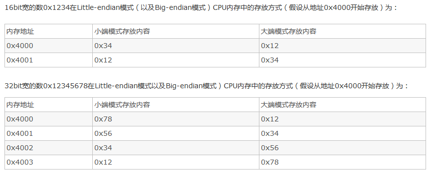

### 大端和小端
Big-Endian和Little-Endian的定义如下：

1) Little-Endian就是低位字节排放在内存的低地址端，高位字节排放在内存的高地址端。

2) Big-Endian就是高位字节排放在内存的低地址端，低位字节排放在内存的高地址端。

比如数字0x12 34 56 78在内存中的表示形式为：

1)大端模式：

低地址 -----------------> 高地址
0x12  |  0x34  |  0x56  |  0x78

2)小端模式：

低地址 ------------------> 高地址
0x78  |  0x56  |  0x34  |  0x12

