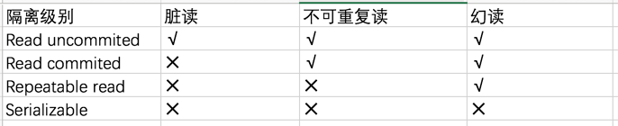

### 读未提交（Read Uncommitted）

在该隔离级别，所有事务都可以看到其他未提交事务的执行结果。读取未提交的数据，也被称之为脏读（Dirty Read）。

### 读已提交（Read Committed）

一个事务只能看见已经提交事务所做的改变。这种隔离级别 也支持所谓的不可重复读（Nonrepeatable Read），因为同一事务的其他实例在该实例处理其间可能会有新的commit，所以同一select可能返回不同结果。

!>同一事务内，两次相同 select 可能结果不一样，既不可重复读。

### 可重复读（Repeatable Read）

MySQL的默认事务隔离级别。确保同一事务的多个实例在并发读取数据时，会看到同样的数据行。会导致另一个棘手的问题：幻读 （Phantom Read）。
!>幻读指当用户读取某一范围的数据行时，另一个事务又在该范围内插入了新行，当用户再读取该范围的数据行时，会发现有新的“幻影” 行。

### 可串行化（Serializable）

最高的隔离级别，它通过强制事务排序，使之不可能相互冲突，从而解决幻读问题。简言之，它是在每个读的数据行上加上共享锁。在这个级别，可能导致大量的超时现象和锁竞争。

四种隔离级别采取不同的锁类型来实现，若读取的是同一个数据的话，就容易发生问题。例如：
* **脏读(Drity Read)**：某个事务已更新一份数据，另一个事务在此时读取了同一份数据，由于某些原因，前一个RollBack了操作，则后一个事务所读取的数据就会是不正确的。
* **不可重复读(Non-repeatable read)**：在一个事务的两次查询之中数据不一致，这可能是两次查询过程中间插入了一个事务更新的原有的数据。
* **幻读(Phantom Read)**：在一个事务的两次查询中数据笔数不一致，例如有一个事务查询了几列(Row)数据，而另一个事务却在此时插入了新的几列数据，先前的事务在接下来的查询中，就会发现有几列数据是它先前所没有的。

在MySQL中，实现了这四种隔离级别，分别有可能产生问题如下所示：

