### 分辨率

#### 屏幕分辨率

屏幕分辨率指一个屏幕具体由多少个像素点组成。
>分辨率高不代表屏幕就清晰，屏幕的清晰程度还与尺寸有关

#### 图像分辨率

指图片含有的像素数，比如一张图片的分辨率为800 x 400。这表示图片分别在垂直和水平上所具有的像素点数为800和400

>同一尺寸的图片，分辨率越高，图片越清晰

#### PPI
每英寸包括的像素数

#### DPI

每英寸包括的点数
>点可以是屏幕像素点、图片像素点也可以是打印机的墨点

### 设备独立像素

上面描述的像素都是物理像素，即设备上真实的物理单元。

#### 设备独立像素

用一种单位来同时告诉不同分辨率的手机，它们在界面上显示元素的大小是多少，这个单位就是设备独立像素(Device Independent Pixels)简称`DIP`或`DP`

低分辨率的手机，它的分辨率是`320x480`，高分辨率的手机`640x940`。理论上来讲，在低分辨率手机上相同大小的图片和文字，在高分辨率手机上会被缩放一倍，因为它的分辨率提高了一倍。这样，岂不是后面出现更高分辨率的手机，页面元素会变得越来越小吗？

事实并不是这样的，我们现在使用的智能手机，不管分辨率多高，他们所展示的界面比例都是基本类似的。乔布斯在iPhone4的发布会上首次提出了`Retina Display(视网膜屏幕)`的概念，它正是解决了上面的问题，这也使它成为一款跨时代的手机。
>在iPhone4使用的视网膜屏幕中，把2x2个像素当1个像素使用，这样让屏幕看起来更精致，但是元素的大小却不会改变。

如果高分辨率手机使用了视网膜屏幕的技术，那么显示结果应该是下面的情况，比如列表的宽度为`300`个像素，那么在一条水平线上，低分辨率手机会用`300`个物理像素去渲染它，而高分辨率手机实际上会用`600`个物理像素去渲染它。

我们必须用一种单位来同时告诉不同分辨率的手机，它们在界面上显示元素的大小是多少，这个单位就是`设备独立像素`(Device Independent Pixels)简称`DIP`或`DP`。

打开`chrome`的开发者工具，我们可以模拟各个手机型号的显示情况，每种型号上面会显示一个尺寸，比如`iPhone X`显示的尺寸是`375x812`，实际`iPhone X`的分辨率会比这高很多，这里显示的就是`设备独立像素`。

#### 设备像素比

设备像素比device pixel ratio简称`dpr`，即物理像素和设备独立像素的比值。

在`web`中，浏览器为我们提供了`window.devicePixelRatio`来帮助我们获取dpr。

在`css`中，可以使用媒体查询`min-device-pixel-ratio`，区分`dpr`：
```css
@media (-webkit-min-device-pixel-ratio: 2),(min-device-pixel-ratio: 2){ }
```

当然，上面的规则也有例外，iPhone 6、7、8 Plus的实际物理像素是1080 x 1920，在开发者工具中我们可以看到：它的设备独立像素是414 x 736，设备像素比为3，设备独立像素和设备像素比的乘积并不等于1080 x 1920，而是等于1242 x 2208。

实际上，手机会自动把1242 x 2208个像素点塞进1080 * 1920个物理像素点来渲染，我们不用关心这个过程，而1242 x 2208被称为屏幕的设计像素。我们开发过程中也是以这个设计像素为准。

实际上，从苹果提出视网膜屏幕开始，才出现设备像素比这个概念，因为在这之前，移动设备都是直接使用物理像素来进行展示。

紧接着，Android同样使用了其他的技术方案来实现DPR大于1的屏幕，不过原理是类似的。由于Android屏幕尺寸非常多、分辨率高低跨度非常大，不像苹果只有它自己的几款固定设备、尺寸。所以，为了保证各种设备的显示效果，Android按照设备的像素密度将设备分成了几个区间：
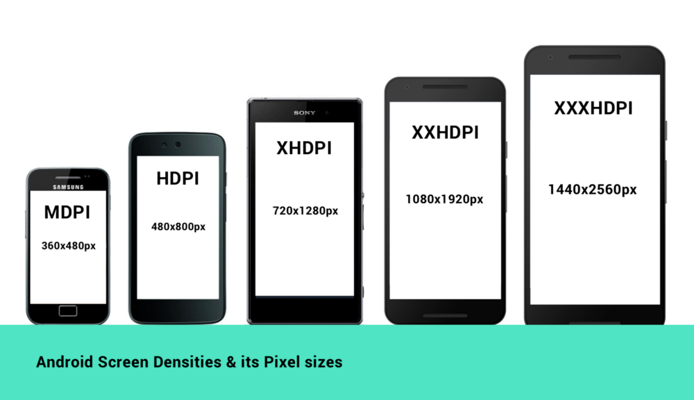

当然，所有的Android设备不一定严格按照上面的分辨率，每个类型可能对应几种不同分辨率，所以，每个Android手机都能根据给定的区间范围，确定自己的DPR，从而拥有类似的显示。当然，仅仅是类似，由于各个设备的尺寸、分辨率上的差异，设备独立像素也不会完全相等，所以各种Android设备仍然不能做到在展示上完全相等。

#### 移动端开发

在`iOS`、`Android`和`React Native`开发中样式单位其实都使用的是`设备独立像素`。

`OS`的尺寸单位为`pt`，`Android`的尺寸单位为`dp`，`React Native`中没有指定明确的单位，它们其实都是设备独立像素`dp`。

在写样式时需要把物理像素转换为`设备独立像素`：例如：如果给定一个元素的高度为`200px`(**这里的px指物理像素，非CSS像素**)，`iphone6`的设备像素比为`2`，我们给定的`height`应为`200px/2=100dp`。

进行px和dp的转换：
```js
const dpr = PixelRatio.get();

/**
 * px转换为dp
 */
export function pxConvertTodp(px) {
  return px / dpr;
}

/**
 * dp转换为px
 */
export function dpConvertTopx(dp) {
  return PixelRatio.getPixelSizeForLayoutSize(dp);
}
```

#### WEB 端开发

在写`CSS`时，用到最多的单位是`px`，即`CSS像素`，**当页面缩放比例为100%时，一个`CSS像素`等于一个`设备独立像素`**。

`CSS像素`是很容易被改变的，当用户对浏览器进行了放大，`CSS像素`会被放大，这时一个`CSS像素`会跨越更多的`物理像素`。

>页面的缩放系数 = CSS像素 / 设备独立像素

#### 关于屏幕

让多个物理像素渲染一个独立像素只是`Retina`屏幕为了达到效果而使用的一种技术。而不是所有`DPR > 1`的屏幕就是`Retina`屏幕。
>Retina屏幕只是苹果提出的一个营销术语：在普通的使用距离下，人的肉眼无法分辨单个的像素点。

经常见到用K和P这个单位来形容屏幕：
P代表的就是屏幕纵向的像素个数，1080P即纵向有1080个像素，分辨率为1920X1080的屏幕就属于1080P屏幕。
我们平时所说的高清屏其实就是屏幕的物理分辨率达到或超过1920X1080的屏幕。
K代表屏幕横向有几个1024个像素，一般来讲横向像素超过2048就属于2K屏，横向像素超过4096就属于4K屏。

### 视口

视口(`viewport`)代表当前可见的计算机图形区域。在`Web`浏览器术语中，通常与浏览器窗口相同，但不包括浏览器的`UI`， `菜单栏`等——即指你正在浏览的文档的那一部分。

一般所说的视口共包括三种：布局视口、视觉视口和理想视口，它们在屏幕适配中起着非常重要的作用。

#### 布局视口

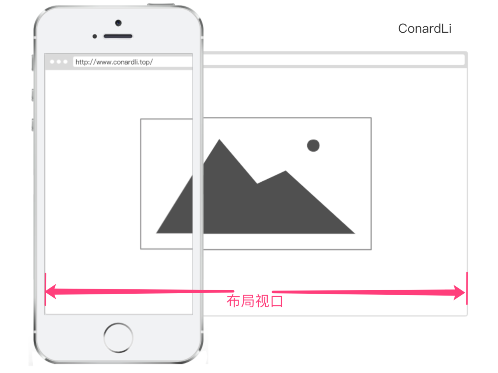

布局视口(`layout viewport`)：当以百分比来指定一个元素的大小时，它的计算值是由这个元素的包含块计算而来的。当这个元素是最顶级的元素时，它就是基于布局视口来计算的。
所以，布局视口是网页布局的基准窗口，在PC浏览器上，布局视口就等于当前浏览器的窗口大小（不包括borders 、margins、滚动条）。
在移动端，布局视口被赋予一个默认值，大部分为`980px`，这保证PC的网页可以在手机浏览器上呈现，但是非常小，用户可以手动对网页进行放大。

可以通过调用`document.documentElement.clientWidth / clientHeight`来获取布局视口大小。

#### 视觉视口

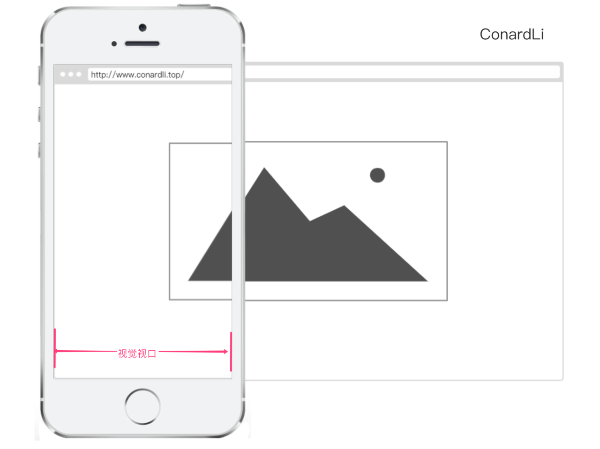

视觉视口(`visual viewport`)：用户通过屏幕真实看到的区域。

视觉视口默认等于当前浏览器的窗口大小（包括滚动条宽度）。

当用户对浏览器进行缩放时，不会改变布局视口的大小，所以页面布局是不变的，但是缩放会改变视觉视口的大小。（是缩放浏览器，不是缩放页面）

例如：用户将浏览器窗口放大了200%，这时浏览器窗口中的CSS像素会随着视觉视口的放大而放大，这时一个CSS像素会跨越更多的物理像素。
所以，**布局视口会限制的CSS布局**而**视觉视口决定用户具体能看到什么**。

我们可以通过调用`window.innerWidth / innerHeight`来获取视觉视口大小。

#### 理想视口

布局视口在移动端展示的效果并不是一个理想的效果，所以理想视口(`ideal viewport`)就诞生了：网站页面在移动端展示的理想大小。

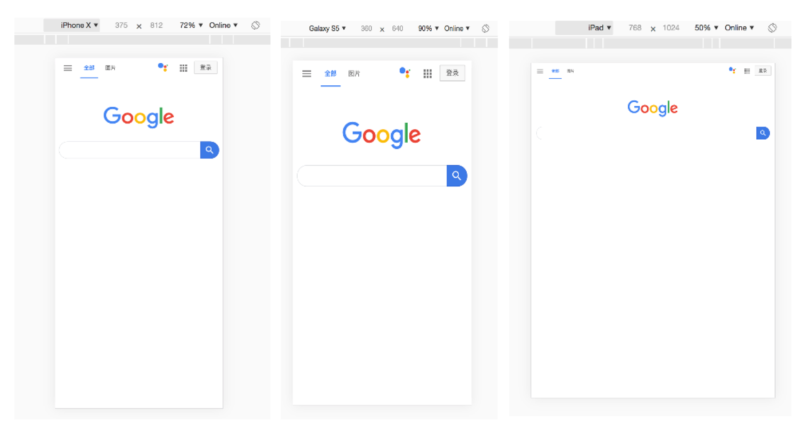

在描述设备独立像素时曾使用过这张图，在**浏览器调试移动端时页面上给定的像素大小就是理想视口大小，它的单位正是设备独立像素**。

在介绍CSS像素时曾经提到`页面的缩放系数 = CSS像素 / 设备独立像素`，实际上说`页面的缩放系数 = 理想视口宽度 / 视觉视口宽度`更为准确。

当页面缩放比例为100%时，`CSS像素 = 设备独立像素，理想视口 = 视觉视口`

通过调用`screen.width / height`来获取理想视口大小。

#### Meta viewport

`<meta>` 元素表示那些不能由其它HTML元相关元素之一表示的任何元数据信息，它可以**告诉浏览器如何解析页面**。

可以借助`<meta>`元素的`viewport`来帮助设置视口、缩放等，从而让移动端得到更好的展示效果。

```html
<meta name="viewport" content="width=device-width; initial-scale=1; maximum-scale=1; minimum-scale=1; user-scalable=no;">
```

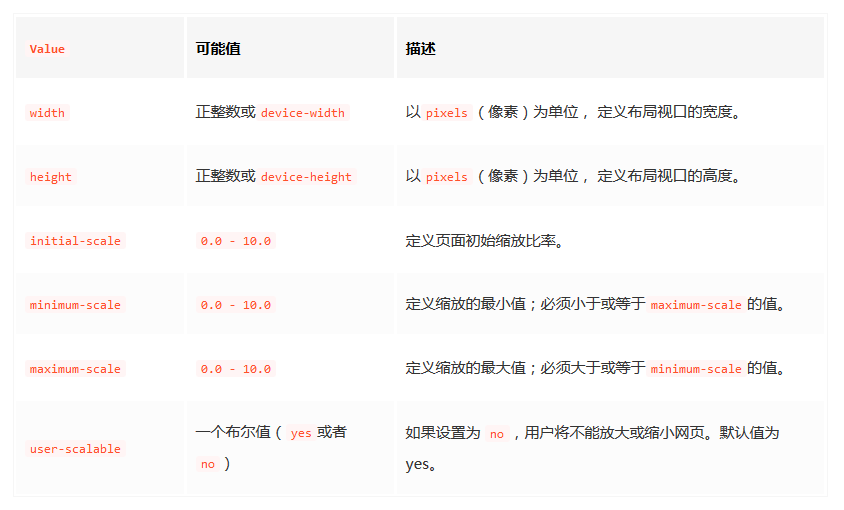

#### 移动端适配

**为了在移动端让页面获得更好的显示效果，必须让布局视口、视觉视口都尽可能等于理想视口**。

`device-width`就等于理想视口的宽度，所以设置`width=device-width`就相当于让布局视口等于理想视口。

由于`initial-scale = 理想视口宽度 / 视觉视口宽度`，所以设置`initial-scale=1`就相当于让视觉视口等于理想视口。
>页面的缩放系数 = 理想视口宽度 / 视觉视口宽度

这时，**1个CSS像素就等于1个设备独立像素*，而且我们也是基于理想视口来进行布局的，所以呈现出来的页面布局在各种设备上都能大致相似。

#### 缩放

`width`可以决定布局视口的宽度，实际上它并不是布局视口的唯一决定性因素，设置`initial-scale`也有影响到布局视口，因为**布局视口宽度取的是width和视觉视口宽度的最大值**。


例如：若手机的理想视口宽度为400px，设置`width=device-width，initial-scale=2`，此时`视觉视口宽度 = 理想视口宽度 / initial-scale`即200px，布局视口取两者最大值即`device-width 400px`。

若设置`width=device-width，initial-scale=0.5`，此时`视觉视口宽度 = 理想视口宽度 / initial-scale`即`800px`，布局视口取两者最大值即`800px`。

#### 获取浏览器大小

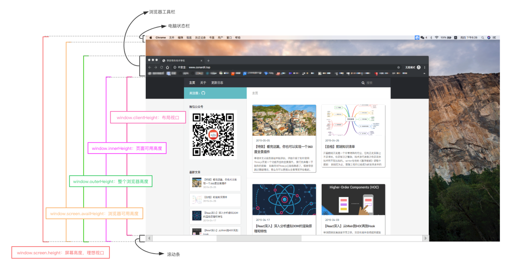

* `window.innerHeight`：获取浏览器视觉视口高度（包括垂直滚动条）。
* `window.outerHeight`：获取浏览器窗口外部的高度。表示整个浏览器窗口的高度，包括侧边栏、窗口镶边和调正窗口大小的边框。
* `window.screen.Height`：获取获屏幕取理想视口高度，这个数值是固定的，设备的分辨率/设备像素比
* `window.screen.availHeight`：浏览器窗口可用的高度。
* `document.documentElement.clientHeight`：获取浏览器布局视口高度，包括内边距，但不包括垂直滚动条、边框和外边距。
* `document.documentElement.offsetHeight`：包括内边距、滚动条、边框和外边距。
* `document.documentElement.scrollHeight`：在不使用滚动条的情况下适合视口中的所有内容所需的最小宽度。测量方式与clientHeight相同：它包含元素的内边距，但不包括边框，外边距或垂直滚动条。

### 1PX 问题

为了适配各种屏幕，一般使用`设备独立像素`来对页面进行布局。

而在`设备像素比`大于1的屏幕上，1px实际上是被多个物理像素渲染，这就会出现1px在有些屏幕上看起来很粗的现象。

#### border-image

基于`media`查询判断不同的`设备像素比`给定不同的border-image：
```css
.border_1px{
    border-bottom: 1px solid #000;
}
@media only screen and (-webkit-min-device-pixel-ratio:2){
    .border_1px{
        border-bottom: none;
        border-width: 0 0 1px 0;
        border-image: url(../img/1pxline.png) 0 0 2 0 stretch;
    }
}
```
#### background-image

和border-image类似，准备一张符合条件的边框背景图，模拟在背景上。
```css
.border_1px{
    border-bottom: 1px solid #000;
}
@media only screen and (-webkit-min-device-pixel-ratio:2){
    .border_1px{
        background: url(../img/1pxline.png) repeat-x left bottom;
        background-size: 100% 1px;
    }
}
```
面两种都需要单独准备图片，而且圆角不是很好处理，但是可以应对大部分场景。

#### 伪类 + transform

```css
.border_1px:before{
    content: '';
    position: absolute;
    top: 0;
    height: 1px;
    width: 100%;
    background-color: #000;
    transform-origin: 50% 0%;
}
@media only screen and (-webkit-min-device-pixel-ratio:2){
    .border_1px:before{
        transform: scaleY(0.5);
    }
}
@media only screen and (-webkit-min-device-pixel-ratio:3){
    .border_1px:before{
        transform: scaleY(0.33);
    }
}
```

这种方式可以满足各种场景，如果需要满足圆角，只需要给伪类也加上`border-radius`即可。

#### svg

借助PostCSS的postcss-write-svg我们能直接使用border-image和background-image创建svg的1px边框：

```css
@svg border_1px { 
  height: 2px; 
  @rect { 
    fill: var(--color, black); 
    width: 100%; 
    height: 50%; 
    } 
  } 
.example { border: 1px solid transparent; border-image: svg(border_1px param(--color #00b1ff)) 2 2 stretch; }
```
编译后：
```css
.example { border: 1px solid transparent; border-image: url("data:image/svg+xml;charset=utf-8,%3Csvg xmlns='http://www.w3.org/2000/svg' height='2px'%3E%3Crect fill='%2300b1ff' width='100%25' height='50%25'/%3E%3C/svg%3E") 2 2 stretch; }
```

#### 设置viewport

通过设置缩放，让`CSS像素`等于真正的物理像素。

例如：当设备像素比为3时，我们将页面缩放1/3倍，这时1px等于一个真正的屏幕像素。
```js
const scale = 1 / window.devicePixelRatio;
const viewport = document.querySelector('meta[name="viewport"]');
if (!viewport) {
    viewport = document.createElement('meta');
    viewport.setAttribute('name', 'viewport');
    window.document.head.appendChild(viewport);
}
viewport.setAttribute('content', 'width=device-width,user-scalable=no,initial-scale=' + scale + ',maximum-scale=' + scale + ',minimum-scale=' + scale);
```
这种方案是早先`flexible`采用的方案。

这意味着你页面上所有的布局都要按照物理像素来写。这显然是不现实的，这时，可以借助`flexible`或`vw`、`vh`来进行适配。

### 移动端适配方案

尽管可以使用设备独立像素来保证各个设备在不同手机上显示的效果类似，但这并不能保证它们显示完全一致，需要一种方案来让设计稿得到更完美的适配。

#### flexible方案

在页面上统一使用`rem`来布局。

```js
// set 1rem = viewWidth / 10
function setRemUnit () {
    var rem = docEl.clientWidth / 10
    docEl.style.fontSize = rem + 'px'
}
setRemUnit();
```
`rem` 是相对于`html`节点的`font-size`来做计算的。

通过设置`document.documentElement.style.fontSize`就可以统一整个页面的布局标准。

以iPhone6为例：布局视口为`375px`，则`1rem = 37.5px`，这时`UI`给定一个元素的宽为`75px`（设备独立像素），我们只需要将它设置为`75 / 37.5 = 2rem`。

每个布局都要计算非常繁琐，可以借助PostCSS的px2rem插件来完成这个过程。

下面的代码可以保证在页面大小变化时，布局可以自适应，当触发了window的resize和pageShow事件之后自动调整html的fontSize大小。

```js
window.addEventListener('resize', setRemUnit)
window.addEventListener('pageshow', function (e) {
    if (e.persisted) {
      setRemUnit()
    }
})
```
由于`viewport`单位得到众多浏览器的兼容，上面这种方案现在已经被官方弃用

#### vh、vw方案

`vh、vw`方案即将视觉视口宽度 `window.innerWidth`和视觉视口高度 `window.innerHeight` 等分为 100 份。

* `vw(Viewport's width)`：1vw 等于视觉视口的1%
*  `vh(Viewport's height)`:1vh 为视觉视口高度的1%
*  `vmin`: vw 和 vh 中的较小值
*  `vmax`: 选取 vw 和 vh 中的较大值

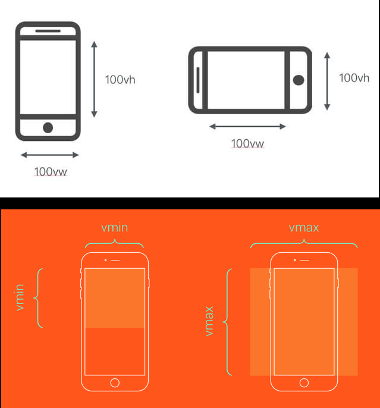

如果视觉视口为`375px`，那么`1vw = 3.75px`，这时UI给定一个元素的宽为`75px`（设备独立像素），我们只需要将它设置为`75 / 3.75 = 20vw`。

可以使用PostCSS的 postcss-px-to-viewport 插件来完成这个过程。写代码时，只需要根据UI给的设计图写px单位即可。

`vw`同样有一定的缺陷：
* `px`转换成`vw`不一定能完全整除，因此有一定的像素差。
* 比如当容器使用`vw`，`margin`采用`px`时，很容易造成整体宽度超过`100vw`，从而影响布局效果。当然我们也是可以避免的，例如使用padding代替margin，结合calc()函数使用等等...

### 适配iPhoneX

物理按键，改成了底部的小黑条，但是这样的改动给开发者适配移动端又增加了难度。

#### 安全区域

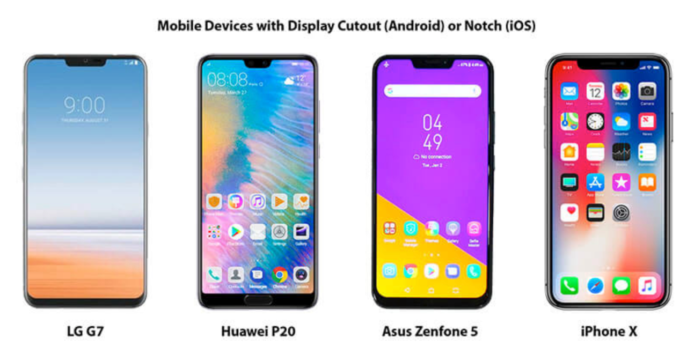

这些手机和普通手机在外观上无外乎做了三个改动：`圆角（corners）`、`刘海（sensor housing）`和`小黑条（Home Indicator）`。为了适配这些手机，安全区域这个概念变诞生了：安全区域就是一个不受上面三个效果的可视窗口范围。

#### viewport-fit

`viewport-fit`是专门为了适配`iPhoneX`而诞生的一个属性，它用于限制网页如何在安全区域内进行展示。

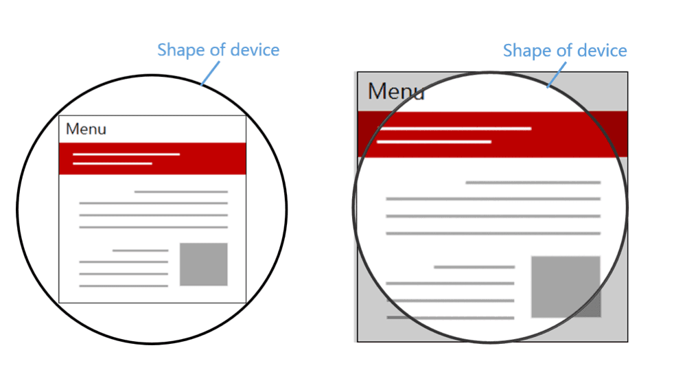

`contain`: 可视窗口完全包含网页内容

`cover`：网页内容完全覆盖可视窗口

默认情况下或者设置为auto和contain效果相同。

#### env、constant

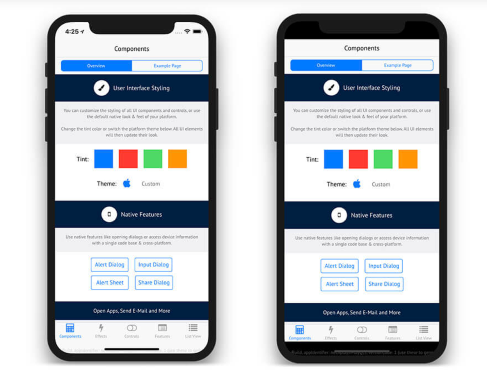

我们需要将顶部和底部合理的摆放在安全区域内，iOS11新增了两个CSS函数env、constant，用于设定安全区域与边界的距离。
函数内部可以是四个常量：

safe-area-inset-left：安全区域距离左边边界距离

safe-area-inset-right：安全区域距离右边边界距离

safe-area-inset-top：安全区域距离顶部边界距离

safe-area-inset-bottom：安全区域距离底部边界距离

注意：我们必须指定viweport-fit后才能使用这两个函数：
```html
<meta name="viewport" content="viewport-fit=cover">
```

constant在iOS < 11.2的版本中生效，env在iOS >= 11.2的版本中生效，这意味着我们往往要同时设置他们，将页面限制在安全区域内：

```css
body {
  padding-bottom: constant(safe-area-inset-bottom);
  padding-bottom: env(safe-area-inset-bottom);
}
```

当使用底部固定导航栏时，我们要为他们设置padding值：

```css
{
  padding-bottom: constant(safe-area-inset-bottom);
  padding-bottom: env(safe-area-inset-bottom);
}
```

### 横屏适配

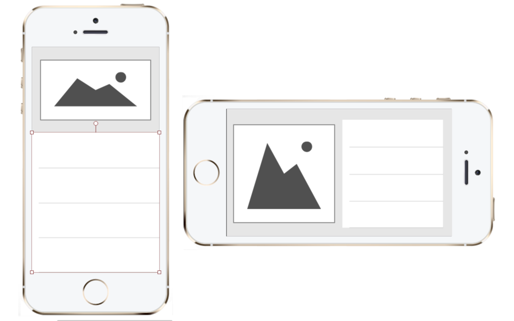

#### JavaScript检测横屏
```js
window.addEventListener("resize", ()=>{
    if (window.orientation === 180 || window.orientation === 0) { 
      // 正常方向或屏幕旋转180度
        console.log('竖屏');
    };
    if (window.orientation === 90 || window.orientation === -90 ){ 
       // 屏幕顺时钟旋转90度或屏幕逆时针旋转90度
        console.log('横屏');
    }  
}); 
```
#### CSS检测横屏
```css
@media screen and (orientation: portrait) {
  /*竖屏...*/
} 
@media screen and (orientation: landscape) {
  /*横屏...*/
}
```

### 图片模糊问题

#### 产生原因

我们平时使用的图片大多数都属于位图（png、jpg...），位图由一个个像素点构成的，每个像素都具有特定的位置和颜色值：
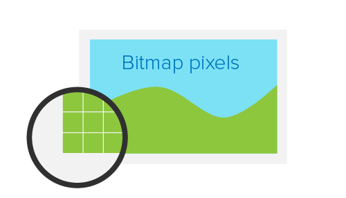

理论上，位图的每个像素对应在屏幕上使用一个物理像素来渲染，才能达到最佳的显示效果。

而在`dpr > 1`的屏幕上，位图的一个像素可能由多个物理像素来渲染，然而这些物理像素点并不能被准确的分配上对应位图像素的颜色，只能取近似值，所以相同的图片在dpr > 1的屏幕上就会模糊:

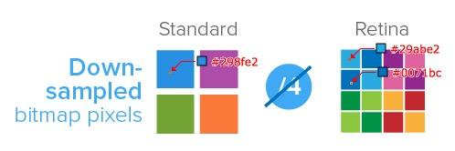

#### 解决方案

针对不同DPR的屏幕，我们需要展示不同分辨率的图片。

#### media查询

```css
.avatar{
    background-image: url(conardLi_1x.png);
}
@media only screen and (-webkit-min-device-pixel-ratio:2){
    .avatar{
        background-image: url(conardLi_2x.png);
    }
}
@media only screen and (-webkit-min-device-pixel-ratio:3){
    .avatar{
        background-image: url(conardLi_3x.png);
    }
}

```
#### image-set

```css
.avatar {
    background-image: -webkit-image-set( "conardLi_1x.png" 1x, "conardLi_2x.png" 2x );
}
```
#### srcset
使用img标签的srcset属性，浏览器会自动根据像素密度匹配最佳显示图片：
```html

```

#### JavaScript拼接图片url

```js
const dpr = window.devicePixelRatio;
const images =  document.querySelectorAll('img');
images.forEach((img)=>{
  img.src.replace(".", `@${dpr}x.`);
})
```
#### 使用svg


