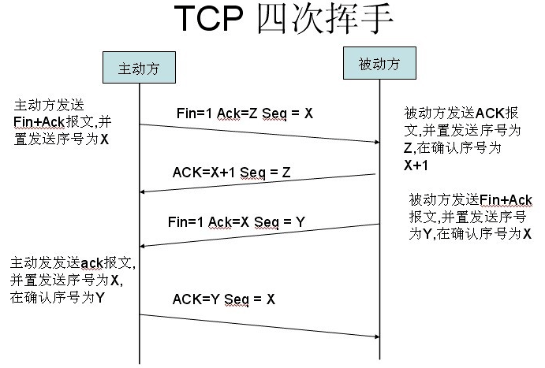

### 三次握手

**第一次握手**： 建立连接。客户端发送连接请求报文段，将SYN位置为1，Sequence Number为x；然后，客户端进入SYN_SEND状态，等待服务器的确认。

!>客户端发送网络包，服务端收到了。这样服务端就能得出结论：客户端的发送能力、服务端的接收能力是正常的

**第二次握手**： 服务器收到客户端的SYN报文段，需要对这个SYN报文段进行确认，设置Acknowledgment Number为x+1(Sequence Number+1)；同时，自己自己还要发送SYN请求信息，将SYN位置为1，Sequence Number为y；服务器端将上述所有信息放到一个报文段（即SYN+ACK报文段）中，一并发送给客户端，此时服务器进入SYN_RECV状态。

!>服务端发包，客户端收到了。这样客户端就能得出结论：服务端的接收、发送能力，客户端的接收、发送能力是正常的。

**第三次握手**：客户端收到服务器的SYN+ACK报文段。然后将Acknowledgment Number设置为y+1，向服务器发送ACK报文段，这个报文段发送完毕以后，客户端和服务器端都进入ESTABLISHED状态，完成TCP三次握手。

!>客户端发包，服务端收到了。这样服务端就能得出结论：客户端的接收、发送能力，服务端的发送、接收能力是正常的。

第一、二次握手后，服务端并不知道客户端的接收能力以及自己的发送能力是否正常。而在第三次握手时，服务端收到了客户端对第二次握手作的回应。从服务端的角度，我在第二次握手时的响应数据发送出去了，客户端接收到了。所以，我的发送能力是正常的。而客户端的接收能力也是正常的。

经历了上面的三次握手过程，客户端和服务端都确认了自己的接收、发送能力是正常的。之后就可以正常通信了。

防止超时导致脏连接：

如果使用的是两次握手建立连接，假设有这样一种场景：

客户端发送了第一个请求连接并且没有丢失，只是因为在网络结点中滞留的时间太长了，由于TCP的客户端迟迟没有收到确认报文，以为服务器没有收到，此时重新向服务器发送这条报文。

此后客户端和服务器经过两次握手完成连接，传输数据，然后关闭连接。此时此前滞留的那一次请求连接，网络通畅了到达了服务器，这个报文本该是失效的，但是，两次握手的机制将会让客户端和服务器再次建立连接，这将导致不必要的错误和资源的浪费。

如果采用的是三次握手，就算是那一次失效的报文传送过来了，服务端接受到了那条失效报文并且回复了确认报文，但是客户端不会再次发出确认。由于服务器收不到确认，就知道客户端并没有请求连接。

!>首次连接请求在连接断开后还没有到达，到达后服务端回应，客户端不处理。

### 四次挥手

**第一次分手**： 主机1（可以使客户端，也可以是服务器端），设置Sequence Number，向主机2发送一个FIN报文段；此时，主机1进入FIN_WAIT_1状态；这表示主机1没有数据要发送给主机2了。

**第二次分手**：主机2收到了主机1发送的FIN报文段，向主机1回一个ACK报文段，Acknowledgment Number为Sequence Number加1，并进入CLOSE-WAIT状态；主机1进入FIN_WAIT_2状态；主机2告诉主机1，我“同意”你的关闭请求。

**第三次分手**：主机2向主机1发送FIN报文段，请求关闭连接，同时主机2进入LAST_ACK状态。

**第四次分手**：主机1收到主机2发送的FIN报文段，向主机2发送ACK报文段，然后主机1进入TIME_WAIT状态；主机2收到主机1的ACK报文段以后，就关闭连接；此时，主机1等待2MSL后依然没有收到回复，则证明Server端已正常关闭，那好，主机1也可以关闭连接了。

**为什么要四次分手？**

当主机1发出FIN报文段时，只是表示主机1已经没有数据要发送了，主机1告诉主机2，它的数据已经全部发送完毕了；但是，这个时候主机1还是可以接受来自主机2的数据；当主机2返回ACK报文段时，表示它已经知道主机1没有数据发送了，但是主机2还是可以发送数据到主机1的；当主机2也发送了FIN报文段时，这个时候就表示主机2也没有数据要发送了，就会告诉主机1，我也没有数据要发送了，之后彼此就会愉快的中断这次TCP连接。

!>TCP是双向的，所以需要在两个方向分别关闭，每个方向的关闭又需要请求和确认，所以一共就4次。

**为什么要等待2MSL？**
MSL：报文段最大生存时间，它是任何报文段被丢弃前在网络内的最长时间。

第一点：如果主机1直接CLOSED了，那么由于IP协议的不可靠性或者是其它网络原因，导致主机2没有收到主机1最后回复的ACK。那么主机2就会在超时之后继续发送FIN，此时由于主机1已经CLOSED了，就找不到与重发的FIN对应的连接。所以，主机1不是直接进入CLOSED，而是要保持TIME_WAIT，当再次收到FIN的时候，会重启2MSL计时器，能够保证对方收到ACK，最后正确的关闭连接。

第二点：如果主机1直接CLOSED，然后又再向主机2发起一个新连接，我们不能保证这个新连接与刚关闭的连接的端口号是不同的。也就是说有可能新连接和老连接的端口号是相同的。一般来说不会发生什么问题，但是还是有特殊情况出现：假设新连接和已经关闭的老连接端口号是一样的，如果前一次连接的某些数据仍然滞留在网络中，这些延迟数据在建立新连接之后才到达主机2，由于新连接和老连接的端口号是一样的，TCP协议就认为那个延迟的数据是属于新连接的，这样就和真正的新连接的数据包发生混淆了。所以TCP连接还要在TIME_WAIT状态等待2倍MSL，这样可以保证本次连接的所有数据都从网络中消失。

!>在TIME_WAIT状态无法真正释放句柄资源，在此期间，Socket中使用的本地端口在默认情况下不能再被使用。
该限制对于客户端机器来说是无所谓的，但对于高并发服务器来说，会极大地限制有效连接的创建数量，称为性能瓶颈。所以建议将高并发服务器TIME_WAIT超时时间调小。RFC793中规定MSL为2分钟。
但是在当前的高速网络中，2分钟的等待时间会造成资源的极大浪费，在高并发服务器上通常会使用更小的值。

